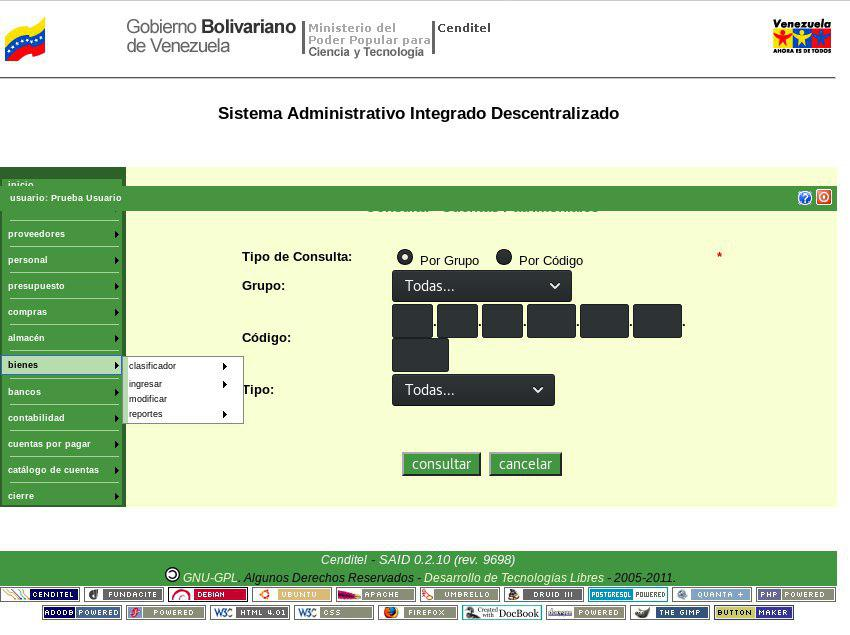
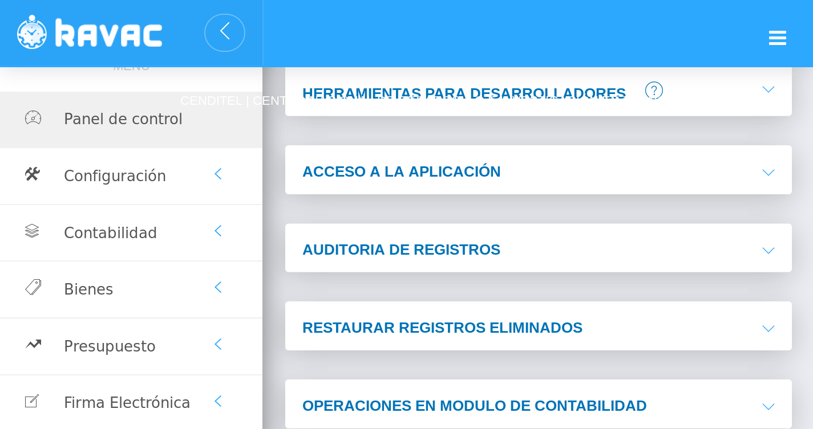

# Información General
*********************

## Antecedentes

### Experiencia de CENDITEL en el desarrollo de sistemas de gestión

  
   En el año 2005 se inició desde FUNDACITE-Mérida el desarrollo de un Sistema Administrativo dirigido a los entes descentralizados de la Administración Pública Nacional, un proyecto sustentado en el artículo 110 de la Constitución de la República Bolivariana de Venezuela, donde se reconoce como de interés público la ciencia, la tecnología, el conocimiento, la innovación y los servicio de información.

   Esta política en materia tecnológica fue apoyada también por el decreto 3.390, publicado en el año 2004 donde se insta a las instituciones gubernamentales a utilizar el Software Libre, fortalecido posteriormente con la Ley de Infogobierno promulgada en el año 2013.

   Este sistema administrativo se denominó en un primer momento Gestión Pública, para el año 2006, con la publicación de la primera versión estable, cambió su nombre a Sistema Administrativo Integrado Descentralizado (SAID), un software que automatiza los procesos administrativos asociados a la gestión de presupuesto y gastos de los entes descentralizados.

   Con la creación del Centro Nacional de Desarrollo e Investigación CENDITEL - Nodo Mérida, en el año 2007, el desarrollo del Sistema de información paso a manos de CENDITEL, quién se encargó de desarrollar nuevos módulos, realizar jornadas de capacitación a nivel de usuario, administración y desarrollo del sistema.

   El SAID es software libre y utiliza el modelo cliente-servidor, mientras que los módulos asociados a la gestión de los recursos económicos están ajustados a los instructivos de formulación y ejecución de presupuestos establecidos por la Oficina Nacional de Presupuesto -ONAPRE.

   Para más información:[tibisay.cenditel.gob.ve](https://tibisay.cenditel.gob.ve/sistema-administrativo-integrado/)

##¿Por qué KAVAC?

   Ante las debilidades que comenzo a presentar el Sistema Administrativo para Instituciones públicas Decentralizadas (SAID),  dada la demanda de distintos requerimientos que eran necesarios llevar a cabo en las instituciones que usaban el sistema y el uso de un lenguaje obsoleto.   Se inicia desde CENDITEL el desarrollo del sistema Kavac con elementos actualizados siguiendo la primicia de “software libre”.   Un Sistema desarrollado bajo elementos innovadores y versatiles en el area de desarrollo con el proposito de reducir líneas de código y establecer un sistema escalable a partir de su código y framework de desarrollo.     

## Tecnología empleada

   Kavac está siendo desarrollado en el lenguaje PHP y el framework Laravel bajo un esquema de programación orientada a objetos (POO) y una arquitectura cliente / servidor, el uso de este framework permite solventar algunas deficiencias del lenguaje en sí como lo es la gestión de grandes volúmenes de datos y cálculos inherentes a la información, con la implementación de métodos dispuestos en la capa ORM ( Object-Relational mapping) que optimizan la respuesta obtenida por el servidor de base de datos ante distintas magnitudes de consultas, además de contar con funciones que permiten realizar diferentes tareas enfocadas al mejor rendimiento de la aplicación.

   PHP es considerado uno de los lenguajes “open source” más utilizados en el desarrollo de aplicaciones web y el lenguaje primordial en la mayor parte de servidores de hospedaje. Como parte de su constante proceso de evolución, en sus últimas versiones (a partir de la 7.x) ha mejorado en cuanto a sintaxis (menos código por mismo resultado y mejoras en sus funcionalidades), rendimiento, de fácil configuración, con una amplia gama de paquetes disponibles para su uso libre y mejoras en el tratamiento de información.

   Laravel es un framework de desarrollo para PHP el cual cuenta con una gran cantidad de funcionalidades que permiten entre otras cosas: mejorar el rendimiento de los procesos, prevenir la exposición ante ataques conocidos, continua actualización en pro de mejoras sustanciales, amplia comunidad de desarrollo, núcleo basado en symfony, documentación sustancial en todos los componentes del framework, disponibilidad de cientos de paquetes “open source” que pueden ser implementados sin complejidad, configuración sencilla, gestión de recursos del servidor de aplicación y base de datos de una forma óptima, sintaxis intuitiva, entre otros.

   En el desarrollo de la aplicación administrativa para la gestión de recursos Kavac se plantea implementar, en cuanto a la optimización de algunos procesos que requieren cálculos a gran escala, el uso de:

   1. Procedimientos almacenados: No dependen del lenguaje de desarrollo sino de la capacidad del gestor de base de datos en las tareas de cálculo y gestión de la información.

   2. Tareas programadas o delegadas: Permite delegar tareas de cómputo a la capacidad de cálculo del servidor sin obstruir el funcionamiento de la aplicación. 

   3. Interacción directa con el servidor: Posibilidad de interactuar directamente con el servidor de base de datos sin depender del lenguaje de desarrollo acelerando el proceso de consulta y gestión de la información.
    
   4. Disparadores de eventos: Generar notificaciones al usuario cuando una tarea haya sido culminada por el servidor.
   
   5. Gestión de cache: Almacenar información en la cache del servidor para no repetir consultas cada vez que esta sea solicitada a menos que la misma haya sido modificada, lo cual permitirá tiempos de respuesta casi imperceptibles.
   
   6. Configuraciones sugeridas en un entorno en producción de aplicaciones web
 
   7. Lenguaje de Desarrollo: Optimización de las variables de configuración dispuestas por el lenguaje para mejorar su rendimiento y aumentar las capacidades del mismo (aplica para cualquier lenguaje de desarrollo).
   
   8. Clúster de Servidores de Base de Datos: Permite la optimización y mejoras en cuanto al tiempo de respuesta en la capacidad de cálculo. Importante tomar en cuenta para la gestión de grandes volúmenes de datos pero no limitativo.
   
   9. Balanceo de Cargas: Configuración de un esquema de cargas balanceadas tanto en la capa del servidor de aplicación.

## Interfaz gráfica

###Página de ingreso
   
   El sistema kavac cuenta con una página inicial de entrada, correspondiente a la ventana de ingreso y verificación de datos de usuarios. La estructura de esta página inicial está formada por una imagen de fondo, una serie de campos de verificación correspondientes a la cuenta de usuario, contraseña y un campo de verificación de captcha. El campo de verificación de captcha se completa conforme al texto descrito en la imagen, dicha imagen tiene la posibilidad de ser actualizada para mejorar la visualización del texto descrito. Los botones de selección permiten recordar contraseña al momento de un nuevo inicio de sesión.

###Elementos de identificación

   Dentro de los elementos de identificación como componentes de nuestra interfaz gráfica se encuentra el logo original y título del sistema kavac.

###Página inicial

   Página inicial o área de trabajo, se encuentra estructurada por una serie de elementos de navegación conformando el sistema y haciéndolo intuitivo a través de una barra de navegación superior, un panel lateral o menú del sistema, y el panel principal de operaciones.

###Panel superior

   Panel superior o barra de navegación, cuenta en su parte derecha con el logo kavac y un botón de despliegue para ocultar y mostrar el panel lateral, en la parte izquierda se muestran una serie de herramientas funcionales como lo son: buzón de notificaciones, buzón de mensajería, selector de idioma, chat, contacto con soporte técnico, configuración de base de datos y configuración de cuenta usuario.

###Panel lateral

   Panel lateral o menú del sistema, ubicado al lado derecho de la pantalla es la barra de navegación principal del sistema donde se ubican cada uno de los módulos o aplicaciones, cada módulo posee un botón con opción de despliegue para las subcategorías en que se divide dicho módulo.

###Panel principal

   Panel principal, es la ventana de operaciones en general de todas las actividades a realizar y registradas, cuenta con barras de navegación, buscadores, tablas de contenido en forma clasificada, gráficos, campos de registros entre otros. Se encuentra identificado en la parte superior de la ventana dependiendo el área en la que se está trabajando. 

###Elementos comunes en la interfaz del sistema

   Dentro de los elementos funcionales comunes de la interfaz gráfica del sistema se encuentran los siguientes elementos:

####Acciones de formulario

   Se muestran tres botones comunes para las ventanas del sistema, elementos que corresponden a las funciones de borrar datos, cancelar y guardar respectivamente.

####Acciones de registro

   Estos elementos corresponden a las funciones de regresar, crear nuevo registro e imprimir respectivamente.

   
   Estos elementos corresponden a las funciones de editar, borrar, ver y aprobar registro respectivamente.

   Estos elementos corresponden a las funciones de buscar, subir y descargar datos respectivamente.

####Botón de ayuda

   El botón de ayuda que observamos en el encabezado de algunas secciones es un elemento que tiene la función de guiar al usuario en el sistema a través de una documentación de usuario o un tutorial a nivel de interfaz gráfica.  

####Guía tutorial

   En algunos casos el botón de ayuda nos dirige a la documentación de usuario, en su defecto, se mostrará un tutorial a nivel de interfaz gráfica paso a paso con especificaciones de las funcionalidades del sistema. 

##Licencia

###Nombre del producto: Kavac Sistema de Gestión de Recursos

   Nombre del licenciante y año: Fundación CENDITEL (Año)

   Autores: 
   
   - Ing. Roldan Vargas (Líder del Proyecto - Desarrollador)
   - Ing. William Páez (Desarrollador)
   - Ing. Henry Paredes (Desarrollador)
   - Ing. Juan Rosas (Desarrollador) 
   - Econ. Julie Vera (Analista funcional) 
   - Ing. Mariangel Molero (Analista Funcional) 
   - Ing. Kleivymar Montilla (Analista funcional) 
   - Ing. Yennifer Ramírez (Desarrolladora)
   - Hildayra Colmenares (Analista Funcional)
   - Luis Ramírez (Analista funcional y documentador)

###Licencia Combinada de Software y Contenidos de la Fundación CENDITEL   

   La Fundación Centro Nacional de Desarrollo e Investigación en Tecnologías Libres (CENDITEL), ente adscrito al Ministerio del Poder Popular para  Ciencia y Tecnología, concede permiso, por un lado, para usar, copiar, modificar y distribuir libremente y sin fines comerciales el SOFTWARE Kavac Sistema de Gestión (sin garantía alguna) y, por el otro, para copiar, adaptar, publicar y comunicar los contenidos, preservando en ambos casos los derechos morales de los autores y manteniendo los mismos principios para las obras derivadas, de conformidad con los términos y condiciones de las licencias de software y contenidos de la Fundación CENDITEL.

   Cada vez que copie y distribuya este producto debe acompañarlo de una copia de las licencias. Para más información sobre los términos y condiciones de las licencias visite las siguientes direcciones electrónicas:  

   [Licencia de Software]( http://conocimientolibre.cenditel.gob.ve/licencia-de-software-v-1-3/)

   [Licencia de Contenidos]( http://conocimientolibre.cenditel.gob.ve/licencias/)

