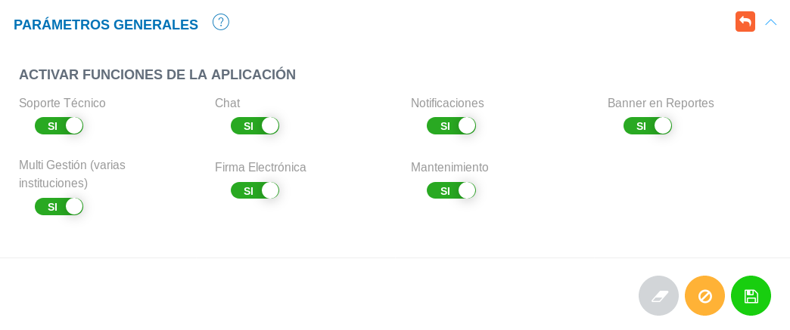
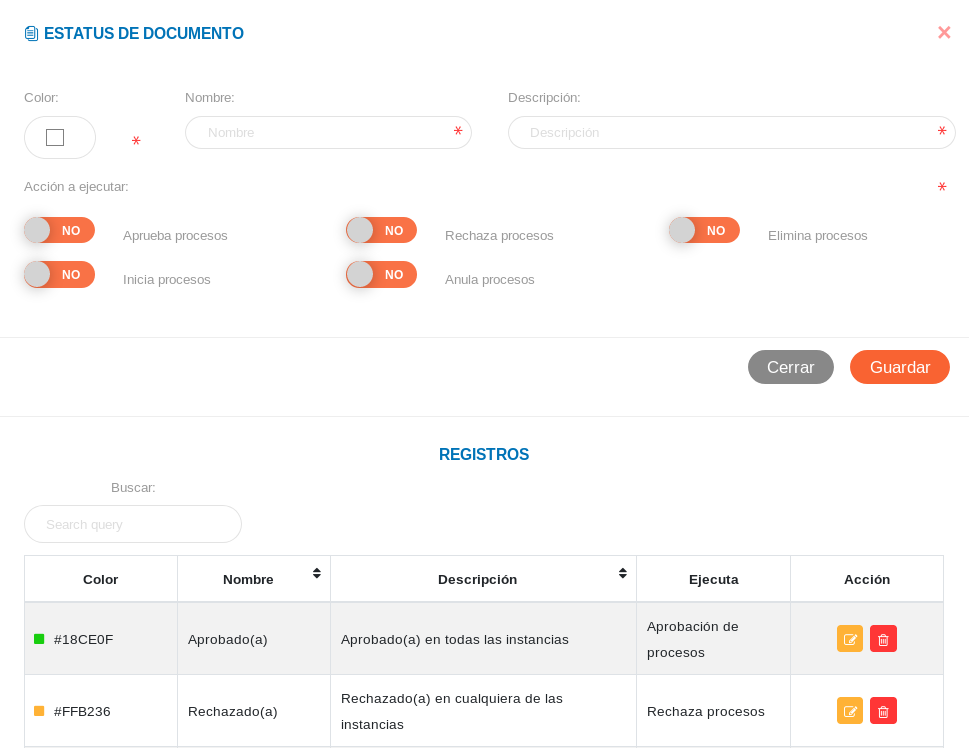
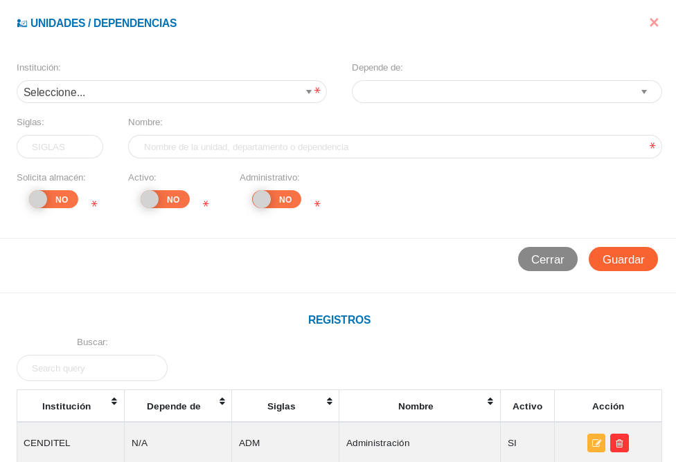
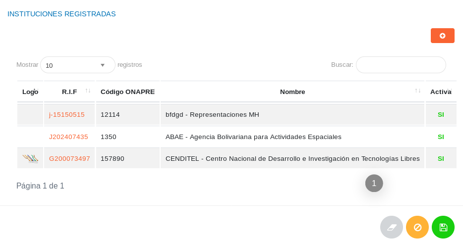

# Administración del sistema 
****************************

La aplicación inicialmente contará con una configuración por defecto que el usuario administrador debe completar a través de los elementos funcionales del sistema, que permitirán ajustar el uso del Kavac a la estructura organizativa y características de la institución usuaria.   A través del panel de control y la configuración se definirán los parámetros útiles para la consolidación del sistema con relación a las instituciones, sus sedes y características organizacionales.   

##Configuración 

El módulo de configuración, permite integrar las herramientas que van a ser utilizadas a lo largo del sistema. Desde registros previos de la organización y su estructura, así como también, funcionalidades del sistema adaptadas a la institución.   La configuración del sistema permite al usuario administrador gestionar las cuentas de usuarios, módulos y el acceso a las distintas áreas del sistema.

##Configuración general del sistema 

###Parámetros generales

La primera sección que se muestra en la interfaz gráfica de la configuración general, corresponde a la de parámetros generales; en el cual, el usuario administrador puede controlar las funcionalidades de la aplicación, habilitando o deshabilitando funciones a través de los botones de selección.
Para ingresar  a esta sección es necesario acceder como usuario administrador,  dirigirse desde el panel lateral a la configuración general y luego a  parámetros generales.  

###Registros Comunes

La sección de registros comunes es una herramienta de la configuración  que permite ajustar a través de parámetros preestablecidos por el usuario administrador el sistema a la organización usuaria.   Los datos registrados en esta sección serán considerados a largo de todo el sistema.

A continuación se presentan algunos ejemplos de registros comunes.

####Estatus de documentos

Los parámetros que el usuario administrador establece en esta sección, son herramientas útiles para las consultas de estatus de documentos. Para completar un registro en la sección de estatus de documentos ubicada en registros comunes de la configuración general del sistema, es necesario completar los campos solicitados. Se requiere definir un color, nombre, descripción y acción que representará el proceso relacionado con flujo de documentos.  

####Profesión

Este registro permitirá al usuario administrador establecer una descripción útil para el uso de registros y designaciones en todo el sistema de las diferentes profesiones.   Para completar un registro en la sección de profesión ubicada en registros comunes de la configuración general del sistema, simplemente completamos los campos solicitados.   Designamos un acrónimo para la profesión, el nombre de dicha profesión y guardamos los cambios.  

####Unidades y dependencias 

Este registro permitirá habilitar los distintos departamentos o dependencias que pertenecen a una institución registrada previamente.   Para completar el registro en la sección de unidades y dependencias ubicada en registros comunes de la configuración general del sistema, es necesario completar los campos solicitados.  Las listas estarán integradas por registros previos tanto de instituciones como dependencias, los campos a completar corresponde a las siglas de departamento o dependencia y su respectivo nombre.  Luego de haber activado la condición del departamento o dependencia a través de los botones de selección, podemos proceder a guardar el registro.    	

###Registro de una institución 

Para el registro de una institución, es necesario acceder como usuario administrador en la Configuración, seleccione General y ubíquese en la ventana  titulada “Configurar Institución”.   En esta sección el usuario debe completar los campos obligatorios y requerimientos relacionados con las características organizacionales de la institución.   Antes de guardar el registro, en esta ventana el usuario puede completar datos adicionales relacionados con la estructura de la institución en la sección “Datos Complementarios”.  

Para guardar el registro es necesario dirigirse a la sección “Instituciones Registradas” al final de la ventana “Configurar Institución” y aplicamos la acción guardar, en esta sección de igual manera se representará de forma inmediata el registro realizado y la posibilidad de realizar un nuevo registro haciendo uso del botón ubicado en la parte superior izquierda de la pantalla.

###Configurar Logos y banners institucionales 

Para añadir un logo y banner institucional es necesario dirigirse a la configuración general, sección  “Configurar Institución” y adjuntar las imágenes correspondientes. Para adjuntar la imagen simplemente ingresamos en alguno de los recuadros, y el sistema nos conducirá a un directorio para cargar la imagen. 

##Configuración de acceso al sistema 

###Gestión de roles

Para la designación de roles y permisos, el usuario administrador debe acceder a la Configuración del sistema, seleccionar Acceso y ubicarse en la sección de Roles y Permisos.   En esta sección el usuario administrador puede observar los distintos permisos y los módulos a los cuales pertenecen, de esta forma, puede asignar permisos de acceso para los distintos roles definidos en el sistema.   A través de las acciones de formulario ubicadas al final de la página guardamos los cambios una vez realizados en esta sección. 

###Crear un nuevo usuario

Para la creación de un nuevo usuario y su designación de rol y permisos  es necesario acceder a la Configuración del sistema, seleccionar Acceso y ubicarse en la sección de “Usuarios”.   En la parte superior izquierda de la pantalla se ubican los iconos de ir atrás, crear usuario y minimizar respectivamente.  Al ingresar en crear usuario se abrirá una nueva ventana para iniciar el registro.  

Cabe destacar que en la sección “Usuarios” de la configuración de acceso al sistema, es posible realizar una serie de acciones.   Desde la columna titulada “Acciones” se puede realizar un consulta de estatus de cuenta de usuario, modificar el registro de la cuenta usuario y eliminar el registro; además cuenta con un historial de registros.

###Gestión de usuario

Una vez iniciado el registro de usuario, se despliega una ventana titulada Gestión de Usuario, donde se procederá a completar los campos requeridos, designación de roles y permisos.   Los campos corresponden a tipo de empleado, dirección de correo electrónico y nombre del usuario. Los roles y permisos son designados a través de los botones de selección habilitando cada una de la acciones pertinentes según corresponda al rol de usuario.   Para la designación de permisos se presentan clasificadas cada una de las acciones pertenecientes a cada módulo.   Una vez se culmine el registro y la designación podemos guardar los cambios al desplazarnos al final de esta ventana. 

##Configuración de módulos del sistema 

###Aplicaciones

El rol de usuario como desarrollador habilita la funcionalidad de configuración del sistema para la gestión de módulos como incorporación o desincorporación, haciendo accesible algunas opciones de configuración avanzadas en toda la aplicación.  Kavac, está diseñado con el objetivo de garantizar independencia entre los módulos para con el sistema base ,de modo que, no afecta en ningun sentido la incorporación o desincorporación de alguno de los módulos.    

###Gestión de módulos 

Como se observo en el capítulo previo en la Instalación del sistema especificamente en la sección de registros iniciales , ejecutamos el comando “ php artisan module: seed ” para revisar que módulos del sistema están habilitados y registrar información requerida por cada uno de ellos.  Al nivel de instalación podemos gestionar cada módulo y sus propiedades, sin embargo, es posible realizar gestión de módulos como usuario administrador y desarrollador desde la interfaz gráfica del sistema ya instalado.   

###Incorporar y desincorporar módulos

Para la gestión de módulos del sistema, es necesario dirigirse a la configuración y seleccionar módulos. En esta sección del sistema podemos apreciar los módulos disponibles, instalados o por instalar , de igual forma, la opción para desinstalar alguno de ellos. A través del botón de color verde podemos realizar la instalación y el botón de color rojo nos permite desinstalar el módulo; de igual forma, se muestra un indicador del estado del módulo ya sea instalado o por instalar.

##Catálogo de aplicaciones 

####[Contabilidad](#)

####[Bienes](#)

####[Presupuesto](#)

####[Atención al ciudadano](#)

####[Firma electrónica](#)

####[Finanzas](#) 
 
####[Talento Humano](#) 

####[Compras](#) 

####[Soporte técnico](#)

####[Depósito](#)

